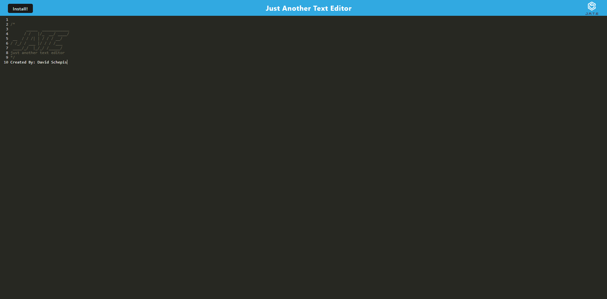

# Text_Editor

## Description
A simple text editor that runs in the browser, allows for offline usage

## Table of Contents

- [Links](#links)
- [Example](#example)
- [Installation](#installation)
- [Usage](#usage)
- [License](#license)
- [Contributing](#contributing)
- [Tests](#tests)
- [Questions](#questions)

 ## Links
Github:

https://github.com/davidschepis/Text_Editor

Deployed:

https://text-editor-1234.herokuapp.com/

 ## Example


 ## Installation
To install necessary dependencies, run the following command:

```
npm i
```

 ## Usage
Sometimes refreshing of the page is required to properly show the icon

 ## License
This project is not licensed

 ## Contributing
Please contact me if you wish to contribute

 ## Tests
To run tests, run the following command:

```
There are no tests
```

 ## Questions
Please contact me at [davidschepis@gmail.com](mailto:davidschepis@gmail.com) with any questions.
Github Repo: [davidschepis](https://github.com/davidschepis).
